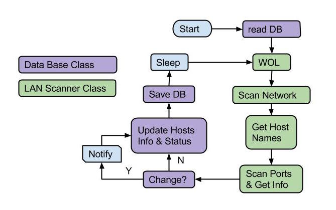

# Network Scanner

Simple python script which uses [nmap](http://) and [avahi](http://www.avahi.org) to:

1. Find hosts that are on the LAN, uses WOL
2. Scan each host to determine: open ports, OS info, MAC address
3. [todo] Notify admin of new hosts on network
4. Store record of hosts in YAML file
5. Creates a webpage for the server to display

## Install and Usage

### Install from Git

	sudo pip install git+https://github.com/walchko/netscan#egg=netscan

### Install from Package

Download and unzip, then from inside the package:

	sudo python setup.py install

If you are working on it:

	sudo python setup.py develop

### Run

	sudo python -m netscan.netscan2

## UNIX Tools

Install:

	OSX: brew install nmap
	Linux: sudo apt-get install nmap

	sudo pip install twilio wol PyYAML python-nmap

Nmap needs to be run as root, using sudo, to do it's job properly.

Nmap network scan:

	sudo nmap -sn -PS22,80,443,3389,5000 -oG - %s 

* `sn` is no port scan, this is the old `sP` arg
* `P` are a listing of select ports
* `G` is grepable output

Nmap host scan:

	nmap -sS -oN - _host-IP_

* `sS` is a TCP SYN to check for open ports
* `oN` is normal output

A full listing of known ports are available on [wikipedia](http://en.wikipedia.org/wiki/List_of_TCP_and_UDP_port_numbers)

**Note:** Both `nmap` commands get pipped through grep, awk, and/or sed to clean the output up for python.

## Data Base

Currently this is just a simple python dictionary which gets stored on the hard drive as a YAML file.

	00:21:5A:FE:BC:4A:
	  hostname: unknown
	  ipv4: 192.168.1.90
	  ports: {'10000': snet-sensor-mgmt, '1026': LSA-or-nterm, '23': telnet, '427': svrloc,
		'515': printer, '5357': wsdapi, '80': http, '9100': jetdirect}
	  status: up
	  type: (Hewlett-Packard

## Notification

Admin notification is via [Twilio](https://www.twilio.com/sms). You can get a free account and text phone numbers you own for free.

## Environment

This program runs on both linux (Raspberry Pi) and OSX.

